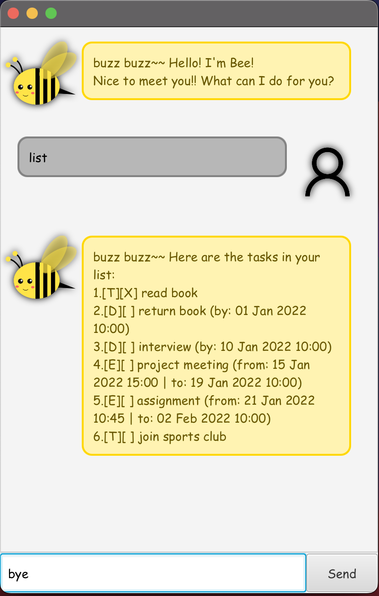

# Bee User Guide



## Product intro
Bee chatbot is a versatile and intuitive virtual
assistant designed to streamline your daily tasks
and enhance productivity. With Bee chatbot, you can
effortlessly manage your to-do lists, schedule events,
and much more.\
Say goodbye to the hassle of juggling multiple apps
and let Bee chatbot revolutionize the way you stay
organized and focused.

## Features
Notes about the command format:

Words in `UPPER_CASE` are the parameters to be
supplied by the user.
e.g. in `todo DESCRIPTION`, `DESCRIPTION` is a
parameter which can be used as `todo read book`.

Extraneous parameters for commands that do not
take in parameters (such as `list`, `bye`)
will be ignored.
e.g. if the command specifies `list 123`,
it will be interpreted as `list`.

## Adding a todo: `todo`

When adding todos, the task will be added to the
task list with the given description.

Format: `todo DESCRIPTION`

Example: `todo read book`

This command adds a todo task with the description
"read book".

Expected Output:
```
buzz buzz~~ I've added this task: 
[T][X] read book
Now you have 1 tasks in the list.
```

## Adding a deadline: `deadline`

When adding deadlines, the task will be added to the
task list with the specified deadline information.

Format: `deadline DESCRIPTION /by DATE`

Example: `deadline return book /by 2022-01-01 10:00`

This command adds a deadline task with the description
"Finish report" and the deadline set to 1 January 2022 10:00.

Expected Output:
```
buzz buzz~~ I've added this task: 
[D][ ] return book (by: 01 Jan 2022 10:00)
Now you have 2 tasks in the list.
```

## Adding a event: `event`

When adding events, the task will be added to the
task list with the specified start datetime and
end datetime information.

Format: `event DESCRIPTION /from START_DATE /to END_DATE`

Example: `event project meeting /from 2022-01-01 10:00 /to 2022-01-01 12:00`

This command adds a event task with the description
"project meeting", start datetime 1 January 2022 10:00
and end datetime 1 January 2022 12:00.

Expected Output:
```
buzz buzz~~ I've added this task: 
[E][ ] project meeting (from: 01 Jan 2022 10:00 | to: 01 Jan 2022 12:00)
Now you have 3 tasks in the list.
```

## Mark tasks: `mark`

User can mark a task as done when task is completed

Format: `mark INDEX`

Example: `mark 1`

This command will mark task 1 in the tasklist.

Expected Output:
```
buzz buzz~~ Nice! I've marked this task as done: 
[T][X] read book
```

## Unmark tasks: `unmark`

User can unmark a task as incomplete when task
was originally marked as done

Format: `unmark INDEX`

Example: `unmark 1`

This command will unmark task 1 in the tasklist.

Expected Output:
```
buzz buzz~~ I've marked this task as not done yet: 
[T][ ] read book
```

## Listing all tasks: `list`

Shows a list of all task in the tasklist.

Format: `list`

Expected Output:
```
buzz buzz~~ Here are the tasks in your list: 
1.[T][ ] read book
2.[D][ ] return book (by: 01 Jan 2022 10:00)
3.[E][ ] project meeting (from: 01 Jan 2022 10:00 | to: 01 Jan 2022 12:00)
```

## Deleting a task: `delete`

Deletes the specified task from the task list.

Format: `delete INDEX`

Example: `delete 1`

This command will delete task 1 in the tasklist.

Expected Output:
```
buzz buzz~~ Noted. I've removed this task: 
[T][ ] read book
Now you have 2 tasks in the list.
```

## Finding tasks: `find`

Find the specified task from the task list.

Format: `find KEYWORD`

Example: `find book`

This command will return all tasks with
description containing the word 'book'.

Expected Output:
```
buzz buzz~~ Here are the matching tasks in your list: 
1.[D][ ] return book (by: 01 Jan 2022 10:00)
```

## Updating a task: `update`

Edits an existing task in the task list.

Format: `update INDEX DESCRIPTION`

Example: `update 1 watch lecture`

This command will update task 1's description
to 'watch lecture'.

Expected Output:
```
buzz buzz~~ I have updated the description: 
1.[D][ ] watch lecture (by: 01 Jan 2022 10:00)
```

## Exiting the program: `bye`

Exits the program.

Format: `bye`

Expected Behaviour: System to exit and close